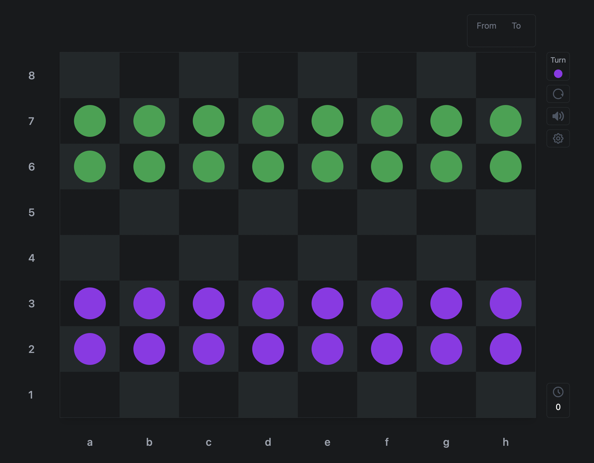

<div>
  <p align="center">
    <i>Turkish Checkers Game</i>
  </p>
  
</div>

<a href="https://tr.wikipedia.org/wiki/Bilim_ve_Teknik">Bilim ve Teknik</a> dergisi, Nisan 1994 sayısı.

# Notice

This is not a completed game. I have not integrated some of the game rules and it is not fully optimized. It's a game I scribble while I'm resting.

## ⚡️ Features

- Turn based game
- Change the color of pieces
- Save game settings to JSON locally
- Light/Dark Mode

## 🛠 Development Setup

```console
  git clone https://github.com/sevilgurkan/checkers-game.git
```
